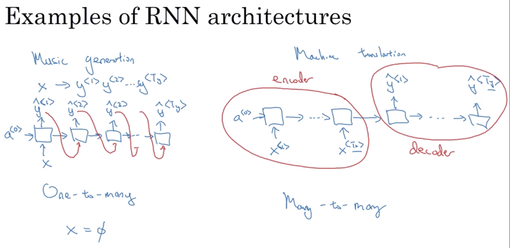

Week1 Recurrent Neural Networks

The input could be sequence or none sequence  
Output could also be sequence or none sequence  
The length of sequence for each training example could also be different  

* We can also pad each input example i to the max length (by 0 padding), such that each input is of the same length. But this is not a decent solution.  
* Feature sharing: Harry as a name learnt at the 1st word, we hope the model can "remember" this. And when it saw a second Harry, it would also know it's a name.  

* Weights are shared for all $t_i$
* To predict $y^{<3>}$ for example, it uses $x^{<3>}$, $x^{<2>}$, and $x^{<1>}$. $x^{<1>}$ passes information through $x^{<2>}$
* To determine if Teddy is a person's name, you cannot decide if just look at first 3 words. To use information later in the sequence, we can use BRNN (Bidirectional RNN)

* $W_{ax}$: 
	* the $a$: $W_{ax}$ is to compute $a$ like quantity
	* the $x$: $W_{ax}$ is multiplied by $x$ like quantity
* $tahnh$ is a common activation function
* Relu is also used
* There are other way to prevent vanishing gradient 

* Forward/Backward propagation **computational graph**
* Backprop through time just back through input sequence examples
* So far, the input length and output length are the same

* One-to-one is just generic neural network

* In music generation, the output $ \widehat{y}^{<t>} $ is also feed into the next layer
* Attention based architecture in week 3

* Many to many: $T_x$ and $T_y$ doesn't have to be the equal

* Language modeling: model the probability of occurence for a sentence

* 1st step in language modeling, tokenize words
* Puncuations tokenizations are optional
* EOS: end of sentence
* UNK: unkown word

* The goal in language model is to predict the next word, given prvious words
* One can train a model using training data with cross entorpy loss
* Then, one can give some words, and ask the model to predict the next word
* Or, one can give a sentence, and ask the model to calculate the probability of this sentence
* Softmax: the probability of first word y. y is every word in the dictionary
* Given $x^{t}$, predict $y^{t+1}$
	* 	Given nothing ($x^{<1>} = \overrightarrow{0}$), predict a softmax for all words in dict for the 1st word ($\widehat{y}^{<1>}$)
	 

